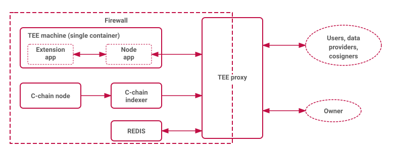

# Architecture

## Participants

FCC has three kinds of participants:

1. **Smart contracts on Flare** — govern [extension](FCE/README.md) management, [TEE machine](Concepts/Machines.md) [registration and attestation](Workflows/MachineRegistration.md), [instruction](Concepts/Instructions.md) issuance, and [private key](Concepts/Keys.md) administration. The on-chain hub is the [`FlareTeeManager`](Reference/Contracts/FlareTeeManager.md) diamond.
2. **[Data providers](../Terminology/Roles.md#data-provider)** — off-chain operators that run a [relay client](Reference/Components/RelayClient.md): they observe [instruction events](Concepts/Instructions.md#sending-instructions) on the Flare C-chain, sign them, and forward them to the destination [TEE proxies](Reference/Components/Proxy.md).
3. **[TEE machines](Concepts/Machines.md)** — enclaves that execute [actions](Concepts/Actions.md) derived from relayed instructions or from [direct actions](Concepts/Actions.md#direct-actions), and sign the result with either their [identity key](Concepts/Machines.md#identity) or a [wallet key](Concepts/Keys.md).

## Instruction Flow

1. A [user](../Terminology/Roles.md#user) issues an [instruction event](Concepts/Instructions.md#sending-instructions) on Flare.
2. Data providers sign the event and submit it to the destination [TEE proxies](Reference/Components/Proxy.md).
3. The TEE proxy aggregates signatures until the [voting threshold](Concepts/Voting.md) is reached, then queues the action for the TEE machine.
4. The TEE machine executes the action and signs the result; the proxy serves the [action response](Concepts/Actions.md#action-responses) publicly, and it may be relayed back on-chain.

Action side effects depend on the operation: a [PMW](../PMW/README.md) action signs a transaction on an external blockchain; a custom [extension](FCE/README.md) action can interact with any external service.

For the integrity assumptions this flow relies on, see [Trust Model](Concepts/TrustModel.md).

## Deployment Topology

Each [TEE operator](../Terminology/Roles.md#tee-operator) deploys:

1. **[TEE machine](Reference/Components/Machine.md)** — a hardware-attested enclave (e.g. on Google Confidential Compute) running the [FCE](FCE/README.md)'s code.
2. **[TEE proxy](Reference/Components/Proxy.md)** — a proxy server managing instruction [voting](Concepts/Voting.md), [action queues](Reference/Components/Proxy.md#processing-queues), and API access.
3. **C-chain indexer** — a database-backed indexer used by the TEE proxy to track [signing policy](../FSP/SigningPolicy.md) updates.
4. **Key-value store with queues** — persistent backing for the proxy's [stores](Reference/Components/Proxy.md#persistent-stores) (e.g. Redis).
