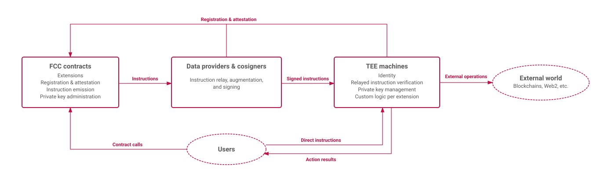
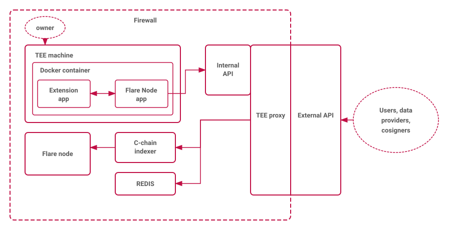

# Architecture
Flare Confidential Compute (FCC) extends the Flare blockchain with the capabilities of Trusted Execution Environments (TEEs).

This page describes the high-level architecture of the system, including the responsibilities of its components, the design philosophy, and the trust model.

## System Components

The system comprises three components, each with defined responsibilities:

1. **Smart contracts**: These govern the underlying logic and control from the Flare blockchain. This includes the management of compute extensions, the registration and attestation of TEE machines, the issuance of messages ([instructions](Operations/Instructions.md)) to be relayed to TEE machines, and some administration of private keys generated and stored within the TEE machines.

2. **Data providers and cosigners**: These entities function as instruction relayers, augmenting instructions with necessary external data, thereby facilitating decentralized computation. These augmented instructions are subsequently signed by each data provider and cosigner before being transmitted to the machines residing in Trusted Execution Environments (TEE machines).

3. **TEE machines**: The TEE machines check that instructions are received with adequate consensus from the data providers and cosigners. Upon receiving the successful relay of instructions, the TEE machine executes the corresponding computation. The result of this computation is then signed with a relevant private key (either the machine's identity key or specialized keys held on the machine) and made available via the [TEE proxy](TEE Management/Tee Proxies.md). Typical results include signed payment transactions for external blockchains or signed attestations usable within smart contracts. See [Actions](Operations/Actions.md) for the structure of action processing.

## Deployment Topology

A TEE machine deployed as part of FCC consists of the following infrastructure:

1. **TEE machine**: The confidential VM running the TEE node, run inside a platform such as Google Confidential Compute.

2. **TEE proxy**: A proxy server managing instructions [voting](Operations/Voting.md), action queues, and API access. See [TEE Proxies](TEE Management/Tee Proxies.md) for details.

3. **C-chain indexer**: A MySQL-backed indexer letting the TEE proxy track information about updates to signing policies.

4. **REDIS**: Persistent storage for proxy state including voting processes, action queues, and key data.

Data providers and cosigners each run a [Relay Client](component-architecture/tee-relay-client.md) that monitors the C-chain for instruction events, augments and signs instructions, and forwards them to the appropriate TEE proxies.

## Design Philosophy

The FCC architecture adopts specific design choices to handle network unreliability and minimize the attack surface.
The system operates on a "verify and execute" model rather than a strictly ordered message delivery model.

### Fire and Forget

The instruction relaying layer is treated as not fully reliable. 
Clients operate on a "fire and forget" principle, meaning they may relay instructions without guaranteeing delivery or ordering.
Consequently, the TEE machine is designed to handle duplicate instructions gracefully:

1. **Default Replayability**: By default, any instruction can be relayed to the TEE machine multiple times. The system does not enforce a global, protocol-level nonce for every instruction.

2. **State-Changing Operations**: Commands that alter the TEE state (e.g. payments, key generation, key restoration) must implement specific replay protection. This is achieved via strict per-machine or per-key nonces checked internally by the TEE machine.

3. **Stateless Operations**: Commands that do not alter state (e.g., signing a fixed message or pure computation) are permitted to be executed multiple times without harm.

### Trust Model and TEE Isolation

The TEE machine is designed to be as sealed as possible to minimize injection vectors.

1. **Untrusted Proxies**: The [TEE Proxy](TEE Management/Tee Proxies.md) corresponding to a TEE machine is considered an untrusted component. Instructions sent by the proxy to the machine are only executed if it is signed appropriately by data providers and cosigners. Thus, the TEE machine does not trust the proxy except to relay instructions. While the proxy acts as a filter in normal operation, a malicious proxy can theoretically censor, delay, or flood the processing queue.

2. **Consensus-Based Verification**: The TEE machine does not independently query blockchain RPC nodes to verify events. Instead, it relies entirely on the consensus of data providers.

3. **Execution Logic**: The TEE machine operates on the logic: "Accept any input from the queue, verify signatures against the signing policy, and execute. If the operation requires uniqueness (state change), enforce it internally; otherwise, proceed." Thus, the TEE machine is isolated to only receive commands from the proxy, and only execute appropriately signed commands.
