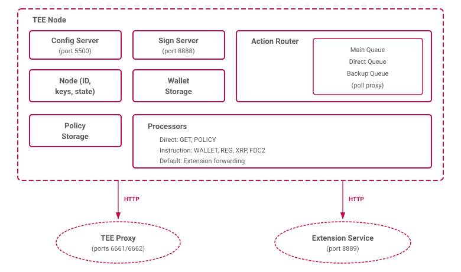

# TEE Node Architecture

The TEE node (`tee-node`) is the core application running inside a Trusted Execution Environment. It manages wallet keys, processes cryptographic operations, validates signing policies, and executes actions received from the TEE proxy.

## Component Overview

## Entry Point and Initialization

The node starts in `cmd/main.go`:

1. **Key generation** — an ECDSA private key is generated inside the TEE. The corresponding Ethereum address becomes the machine's identity ($\mathrm{TEE}_{\mathrm{ID}}$).
2. **Storage initialization** — in-memory wallet storage and policy storage are created (empty).
3. **Config server** — an HTTP server on port $5500$ accepts configuration: proxy URL, initial owner address, and extension ID.
4. **Router creation** — either a `PMWRouter` (system extension only) or `ForwardRouter` (custom extensions) is created and registered with all processors.
5. **Queue workers** — three goroutines are spawned, each continuously polling the proxy for actions on their respective queue (Main, Direct, Backup).

## Action Processing Pipeline

Each queue worker continuously:

1. **Fetch Action** — `POST {proxyURL}/queue/{queueID}`.
2. **Normalize** — `CheckAndAdapt` (align variable messages).
3. **Extract OpID** — `GetOpID` (opType, opCommand hashes).
4. **Route** — if `(opType, opCommand)` is registered, execute the specific processor. Otherwise, forward to the default processor (extension).
5. **Sign Result** — Keccak256 + ECDSA by TEE key.
6. **Post Response** — `POST {proxyURL}/result`.

Workers sleep $100$ ms when the queue is empty and retry on errors.

## Routers

### PMWRouter

Used for TEE machines on the system extension (ID $0$). Registers dedicated processors for all system operations. Unrecognized `(opType, opCommand)` pairs return an error.

### ForwardRouter

Used for TEE machines running custom extensions. Registers the same system processors as `PMWRouter` plus two default processors:

- **DefaultInstruction** — forwards unrecognized instruction actions to the extension service via `POST http://localhost:{extensionPort}/action`.
- **DefaultDirect** — forwards unrecognized direct actions to the extension service.

## Processors

### Direct Processors

Execute immediately, return a result. No signature threshold checking.

| Processor | Op Type | Op Command | Description |
|---|---|---|---|
| `KeysInfo` | F_GET | KEY_INFO | Returns signed key existence proofs for all stored keys |
| `TEEInfo` | F_GET | TEE_INFO | Returns TEE attestation with challenge response |
| `TEEBackup` | F_GET | TEE_BACKUP | Returns backup package for a specific key |
| `InitializePolicy` | F_POLICY | INITIALIZE_POLICY | Sets the initial signing policy |
| `UpdatePolicy` | F_POLICY | UPDATE_POLICY | Updates to the next signing policy |

### Instruction Processors

Multi-phase processors with signature threshold checking. Each instruction goes through preprocessing that validates the signing policy, extracts signers from signatures, and checks weight thresholds.

| Processor | Op Type | Op Command | Immediate Result |
|---|---|---|---|
| `KeyGenerate` | F_WALLET | KEY_GENERATE | Yes |
| `KeyDelete` | F_WALLET | KEY_DELETE | Yes |
| `KeyDataProviderRestore` | F_WALLET | KEY_DATA_PROVIDER_RESTORE | Yes |
| `VRF` | F_WALLET | VRF | Yes |
| `TEEAttestation` | F_REG | TEE_ATTESTATION | Yes |
| `SignXRPLPayment` | F_XRP | PAY / REISSUE | No |
| `FDC2Prove` | F_FDC2 | PROVE | Yes |

### Submission Tags

- `threshold` — emitted when the signing weight threshold is first reached. Most processors produce their main result here.
- `end` — emitted at the end of the voting period. Used for final accounting (e.g., reward data) or for restore operations that need maximum share collection time.
- `submit` — used for direct instruction actions.

### Result Status Codes

- $0$: Error/invalid.
- $1$: Success.
- $2$: In-progress (async operations like XRP payments).
- $3+$: Scheduled responses (XRP fee schedule progression).

## State Management

All state is held in memory, protected by `sync.RWMutex`:

### Node State

- `teeID` — Ethereum address derived from the private key.
- `privateKey` — ECDSA private key (never leaves the TEE).
- `initialOwner` — set once via config server.
- `extensionID` — set once via config server.

### Wallet Storage

A map from `(walletId, keyId)` to wallet data:

- `Wallet` — private key bytes, signing algorithm, admin keys, cosigners, thresholds.
- `WalletStatus` (permanent) — nonce, pauseNonce, status, expiry. Retained even after key deletion for replay protection.

Three signing algorithms are supported: `keccak256-secp256k1-ecdsa` (EVM), `sha512half-secp256k1-ecdsa` (XRP), and `keccak256-secp256k1-vrf` (VRF).

### Policy Storage

- Current and initial signing policies with voter public keys.
- Map of reward epoch ID to signing policy for historical lookups.

## Communication with Proxy

The TEE node communicates with the proxy via two HTTP endpoints:

| Direction | Endpoint | Purpose |
|---|---|---|
| Node → Proxy | `POST /queue/{queueID}` | Dequeue next action from Main, Direct, or Backup queue |
| Node → Proxy | `POST /result` | Push signed action response back to proxy |

The proxy URL is configured via `POST http://localhost:5500/proxy` or the `PROXY_URL` environment variable.

## Extension Integration

### Sign Server (port $8888$)

An HTTP server that extension services can call to use the TEE's cryptographic capabilities:

- `GET /key-info/{walletID}/{keyID}` — retrieve wallet key information.
- `POST /sign/{walletID}/{keyID}` — sign data with a wallet key.
- `POST /sign` — sign data with the TEE identity key.
- `POST /decrypt/{walletID}/{keyID}` — decrypt with a wallet key.
- `POST /decrypt` — decrypt with the TEE identity key.
- `POST /result` — post a signed result back to the proxy.

### Extension Forwarding

When the `ForwardRouter` encounters an unregistered operation, it forwards the full action as an HTTP POST to `http://localhost:{extensionPort}/action` (default port $8889$). The extension service processes the action and returns an `ActionResult`.

## Platform Attestation

The TEE node generates platform attestation tokens depending on the deployment mode:

- **Mode $0$ (production)** — real Google Cloud Confidential Space attestation with JWT token.
- **Mode $1$ (local/development)** — test platform and code hash values.

The attestation is included in `TEE_INFO` and `TEE_ATTESTATION` responses, enabling on-chain verification of the TEE's integrity.

## Configuration

| Variable | Default | Description |
|---|---|---|
| `MODE` | $0$ | $0$ = production, $1$ = local |
| `CONFIG_PORT` | $5500$ | Config server port |
| `SIGN_PORT` | $8888$ | Extension sign server port |
| `EXTENSION_PORT` | $8889$ | Extension service port |
| `PROXY_URL` | — | TEE proxy endpoint |
| `INITIAL_OWNER` | — | Initial owner address (hex) |
| `EXTENSION_ID` | — | Extension ID hash (hex) |

## Key Design Decisions

- **All state in memory** — wallets and policies are never persisted to disk. The TEE's memory is the only storage, ensuring keys cannot be extracted.
- **Interface-based processors** — new operations can be added by implementing the `Processor` interface and registering with the router.
- **Extension forwarding** — custom extensions run as separate processes, communicating via HTTP on localhost. This isolates extension code from the TEE node's core.
- **Separate queues** — Main, Direct, and Backup queues allow priority-based processing (direct queries are not blocked by long-running instruction actions).
