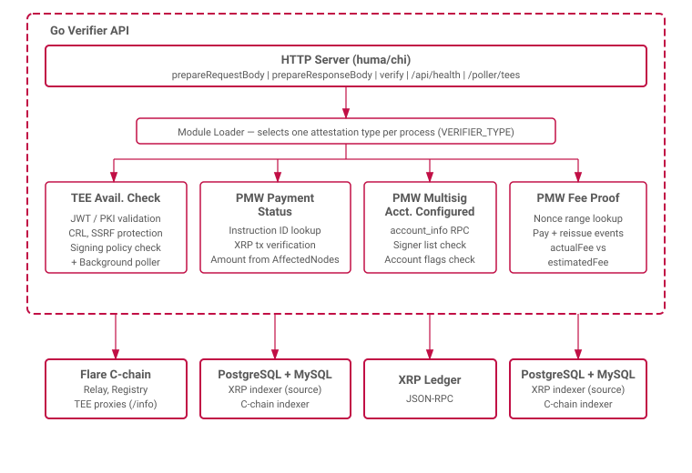

# FDC2 Verifier Server

The FDC2 verifier server validates attestation requests on behalf of data providers.
Each data provider runs a verifier instance for each attestation type it supports.
For the FDC2 protocol and proof format, see [FTDC](../Extensions/FTDC.md).
For per-type verification details, see [attestation types](../attestation-types/).



## HTTP Endpoints

Each loaded attestation type exposes three endpoints:

| Endpoint | Purpose |
|---|---|
| `POST /verifier/<sourceId>/<attestationType>/prepareRequestBody` | ABI-encode a raw request body |
| `POST /verifier/<sourceId>/<attestationType>/prepareResponseBody` | Decode request, run verification, return ABI-encoded response |
| `POST /verifier/<sourceId>/<attestationType>/verify` | Full verification pipeline, return encoded response body |

All endpoints (except `/api/health`) require API key authentication via the `X-API-KEY` header.

### Error Classification

| HTTP Status | Meaning | Examples |
|---|---|---|
| $422$ | Data/validation error | Record not found, TEE validation failure, invalid input |
| $503$ | Infrastructure error (retryable) | DB connection failure, insufficient samples, network error |
| $500$ | Unexpected error | Encoding failure, unknown error |

## Module Loading

One attestation type module is loaded at startup per process.
Each module instantiates its own service, verifier, external data connections, and HTTP handlers.
The supported attestation types are:

- [TeeAvailabilityCheck](../attestation-types/TeeAvailabilityCheck.md)
- [PMWPaymentStatus](../attestation-types/PMWPaymentStatus.md)
- [PMWMultisigAccountConfigured](../attestation-types/PMWMultisigAccountConfigured.md)
- [PMWFeeProof](../attestation-types/PMWFeeProof.md)

---

## Implementation Details

### Generic Verifier Pattern

All attestation types implement the same Go interface:

```go
type Verifier[Req any, Res any] interface {
    Verify(ctx context.Context, req Req) (Res, error)
}
```

Request and response types are defined in `go-flare-common/pkg/tee/structs/connector/autogen.go`, generated from Solidity interface ABIs to match the on-chain proof structures.

### TEE Poller (TeeAvailabilityCheck only)

The `TeeAvailabilityCheck` module includes a background poller monitoring TEE machine availability.
For the full poller specification (sample classification, status determination, availability evaluation), see [TeeAvailabilityCheck](../attestation-types/TeeAvailabilityCheck.md#tee-poller).

- **Polling interval**: every $1$ minute.
- **Active machine list**: fetched from the `TeeMachineRegistry` contract.
- **Worker pool**: $10$ concurrent workers query each TEE's proxy `/info` endpoint.
- **Sample management**: retains the latest $5$ samples per TEE in a circular buffer.
- **DOWN detection**: if all $5$ samples are `INVALID`, the TEE is reported as `DOWN`.
- **Monitoring endpoint**: `GET /poller/tees` returns all TEE samples for external monitoring.

### Security

- **API key authentication** — all verification endpoints require a valid `X-API-KEY` header.
- **URL/SSRF validation** — blocks private IPs, metadata endpoints, and dangerous address ranges before connecting to TEE proxies.
- **CRL checking** — certificate revocation lists are fetched and cached (LRU, $4$-hour TTL, max $100$ entries) to detect revoked attestation certificates.
- **Security headers** — `X-Frame-Options: DENY`, `X-Content-Type-Options: nosniff`.

### Configuration

Environment variables:

| Variable | Required For | Description |
|---|---|---|
| `PORT` | All | HTTP server port |
| `API_KEYS` | All | Comma-separated API keys |
| `VERIFIER_TYPE` | All | Attestation type to load |
| `SOURCE_ID` | All | Source identifier (`TEE`, `XRP`, `testXRP`) |
| `RPC_URL` | TEE, Multisig | Flare C-chain or XRP RPC |
| `RELAY_CONTRACT_ADDRESS` | TEE | Relay contract address |
| `TEE_MACHINE_REGISTRY_CONTRACT_ADDRESS` | TEE | Machine registry address |
| `SOURCE_DATABASE_URL` | Payment, Fee | PostgreSQL connection string |
| `CCHAIN_DATABASE_URL` | Payment, Fee | MySQL connection string |
