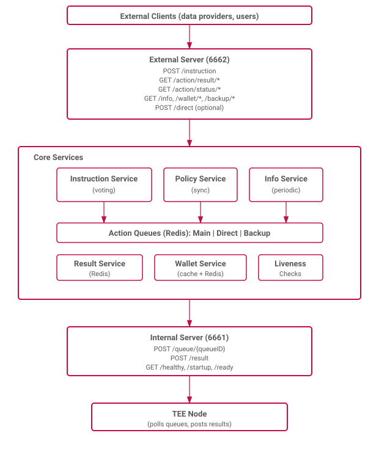

# TEE Proxy Architecture

The TEE proxy controls access to the TEE node.
It manages instruction voting, action queuing, result storage, signing-policy synchronization, wallet tracking, and key backups.
External clients interact with the proxy, not the TEE node directly.



## Component Overview

### Initialization Flow

1. Parse TOML configuration and initialize logging.
2. Connect to the C-chain indexer database (MySQL) and wait for it to sync.
3. Connect to Redis.
4. Create action queues (Main, Direct, Backup) and result storage in Redis.
5. Create the wallet service (in-memory key cache + Redis backup storage).
6. Start the internal server (port $6661$).
7. Start the info service — sends an `INITIALIZE_POLICY` action and a `TEE_INFO` action via the direct queue, waits for responses to establish the TEE's identity.
8. Start the policy service — listens for `SigningPolicyInitialized` events from the Relay contract and creates `UPDATE_POLICY` actions when new policies appear.
9. Start the instruction service — creates voting rounds for the current signing policy.
10. Start the external server (port $6662$).

## Voting System

Threshold-based voting for TEE instructions.

### Data Structure

```
Storage (cyclic buffer by rewardEpochID)
└── Round (one per signing policy)
    ├── Limiter (per-voter request limits)
    └── Voting (instruction voting map)
        └── map[instructionID] → voteBoxes
            └── map[instructionHash] → voteBox
                ├── proposal (instruction + thresholds)
                ├── votes (map[signer → vote])
                ├── weight (accumulated)
                ├── cosignerWeight (accumulated)
                └── finalized (bool)
```

### Voting Flow

1. A data provider submits a signed instruction via `POST /instruction`.
2. The proxy validates the TEE ID, operation pair, and signer identity.
3. The instruction is hashed. A vote box is created (or an existing one is matched) for the `(instructionID, instructionHash)` pair.
4. The signer's weight (from the signing policy) is accumulated.
5. If cosigners are required, cosigner signatures are tracked separately.
6. When both the data provider weight threshold and cosigner threshold are met, the vote box is *finalized*:
   - A `threshold` action is created and enqueued to the Main queue immediately.
   - An `end` action is scheduled for when the voting window expires (default $120$ seconds).
7. The proxy returns a signed receipt to the data provider.

### Cosigner and Threshold Resolution

Cosigners and custom thresholds are resolved per instruction type:

- **XRP payments** (`PAY`, `REISSUE`): cosigners fetched from the wallet configuration.
- **Key restore** (`KEY_DATA_PROVIDER_RESTORE`): cosigners extracted from backup metadata (admin keys and threshold).
- **FDC2** (`PROVE`): custom threshold from the FDC request header (`thresholdBIPS`); $0$ means use the signing policy default.
- **Other instructions**: cosigners and threshold from the instruction event itself.

### Voting Constraints

| Field | Default Limit | Restore Limit |
|---|---|---|
| Original message | $50$ KiB | $50$ KiB |
| Additional fixed message | $100$ KiB | $100$ KiB |
| Additional variable message | $50$ KiB | $1$ MiB |

System operations (`POLICY`, `KEY_INFO`, `TEE_INFO`, `TEE_BACKUP`) cannot be submitted as instructions — they are direct-only.

## Action Queue System

Three independent Redis-backed FIFO queues:

| Queue | Purpose | Populated By |
|---|---|---|
| Main | Instruction actions (voting finalized) | Instruction service |
| Direct | Policy updates, TEE info, wallet sync | Policy service, info service, wallet service |
| Backup | Wallet backup actions | Wallet service (on policy updates) |

Actions are stored in Redis with a $30$-day TTL. The TEE node polls each queue via `POST /queue/{queueID}` and processes actions sequentially (Direct) or concurrently (Main).

## Result Storage

Action results are stored in Redis with TTLs:

| Result Type | TTL |
|---|---|
| Final results (status $0$ or $1$) | $14$ days |
| Transient results (status $2$) | $30$ minutes |
| Submit-type results | $30$ minutes |

Results are keyed by `{actionID}:{submissionTag}`. A final result cannot be overwritten by a lower-status result.

### Result Event Routing

When the TEE node posts a result via `POST /result`, the proxy:

1. Validates the TEE signature (recovers signer address, checks against stored TEE ID).
2. Stores the result in Redis.
3. Routes events to internal channels:
   - **WalletSync** channel — for `KEY_GENERATE`, `KEY_DELETE`, `KEY_DATA_PROVIDER_RESTORE` results (updates in-memory key cache).
   - **Backups** channel — for `TEE_BACKUP` results (stores backup in Redis with $8$-day TTL).
   - **BackupTrigger** channel — for `UPDATE_POLICY` results (triggers re-backup of all keys).

## Signing Policy Management

The policy service:

1. Reads `SigningPolicyInitialized` events from the Relay contract via the C-chain indexer database.
2. On startup, creates an `INITIALIZE_POLICY` action with the current signing policy and voter public keys.
3. Periodically (default $10$ minutes) checks for new policies and creates `UPDATE_POLICY` actions.
4. Broadcasts new policies to the instruction service, which creates new voting rounds.

## Wallet Management

### In-Memory Cache

- `KeysForWallet`: map from wallet ID to list of key IDs.
- `Keys`: map from `(walletId, keyId)` to key data (public key, existence proof).
- Refreshed every $60$ minutes via `GET /KEY_INFO` actions, and on wallet mutation events.

### Backup Storage (Redis)

- `backupIdHash → backupData` — full backup package (TTL: $8$ days).
- `(walletId, keyId) → backupIdHash` — index to latest backup (TTL: $8$ days).
- Backups are re-triggered whenever the signing policy updates (new shares for new providers).

## Info Service

Sends a `TEE_INFO` action via the direct queue every $10$ seconds, using the latest block hash as a challenge. The response contains the TEE's public key, signing policy data, machine state, and platform attestation. The latest attestation is cached and served via `GET /info`.

## Health Checks

| Endpoint | Checks |
|---|---|
| `GET /healthy` | Always returns $200$ |
| `GET /startup` | Returns $200$ only after initialization completes |
| `GET /ready` | Startup complete, Redis responsive, C-chain indexer synced (delay $< 140$ s), TEE info fresh ($< 140$ s) |

## External Dependencies

- **Redis** — action queues, result storage, wallet backups, pub/sub for result notifications.
- **MySQL** — C-chain indexer database for blockchain events (signing policies, instruction events).
- **TEE Node** — communicates via internal HTTP endpoints on localhost.
- **Relay Contract** — on-chain signing policy source.
- **VoterRegistry Contract** — maps voter addresses to public keys.

## Configuration

Configuration fields (`config.toml`):

```toml
redis_port = ":6379"
private_key_variable = "PRIVATE_KEY"

[db]                    # C-chain indexer DB
[addresses]             # Relay, VoterRegistry, FlareSystemsManager
[ports]
internal = "6661"
external = "6662"

[voting]
proposal_expiration = "120s"
max_pending_request = 100

[info_timing]
cycle_internal = "10s"
```
