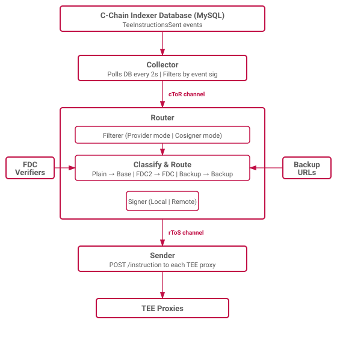

# TEE Relay Client Architecture

The TEE relay client bridges the Flare blockchain and TEE proxy nodes.
It monitors the C-chain for `TeeInstructionsSent` events, processes them by type, signs them with the relay client's key, and relays the signed instructions to the appropriate TEE proxies.
Each data provider and cosigner runs its own instance.



## Data Flow

Three-stage pipeline: **Collector** → **Router** → **Sender**.

## Collector

Monitors the C-chain for `TeeInstructionsSent` events and passes batches of raw log entries to the router.

## Router

Parses raw logs into typed instruction events, filters them, and dispatches to specialized processors.

### Filtering

Two filter modes:

| Mode | Filter Behavior |
|---|---|
| **Provider** | Accepts all instructions. Used by entities in the signing policy. |
| **Cosigner** | Only accepts instructions where the relay client's address appears in the `cosigners` list. |

### Instruction Classification

Each instruction is classified into one of three types based on its operation:

| Class | Condition | Processor | Purpose |
|---|---|---|---|
| **Plain** | Any valid `(opType, opCommand)` not matching below | Base | Standard sign-and-forward |
| **FDC** | `opType = F_FDC2`, `opCommand = PROVE` | FDC | Attestation with external verifier |
| **Backup** | `opType = F_WALLET`, `opCommand = KEY_DATA_PROVIDER_RESTORE` | Backup | Key restoration from shares |

### Base Processor

Signs the instruction with the relay client's key and passes it to the sender.
Handles most instruction types (key generation, key deletion, XRP payments, VRF, TEE attestation, etc.).

### FDC Processor

FDC2 attestation with external verifier integration:

1. Decodes the instruction to extract `attestationType` and `sourceId`.
2. Routes to the appropriate queue based on the `(attestationType, sourceId)` pair.
3. Sends the attestation request to the configured verifier server.
4. The verifier returns the attestation response.
5. The handler computes the FDC vote hash from the attestation response.
6. The instruction is signed and passed to the sender.

### Backup Processor

Wallet key backup restoration (`KEY_DATA_PROVIDER_RESTORE`):

1. Fetches the encrypted backup package from the URL specified in the instruction.
2. Validates the backup package consistency (backup ID matches request parameters, signatures are valid).
3. Identifies which key splits belong to the relay client (matches by public key).
4. Decrypts the key splits using the relay client's private key.
5. Re-encrypts the shares for the target TEE machine using the TEE's public key.
6. Signs the instruction with the encrypted share as `additionalVariableMessage` and backup metadata as `additionalFixedMessage`.
7. Passes to the sender.

## Sender

Receives signed instructions and relays them to TEE proxies.
For each instruction, sends to every TEE machine in the instruction's TEE list.

## Instruction Data Structure

Each instruction in the pipeline carries:

- `Event` — the parsed `TeeInstructionsSent` event (extension ID, op type, op command, message, cosigners, TEE machines).
- `Tees` — deduplicated list of target TEE machines (each with ID and URL).
- `GeneralData` — the instruction payload (without TEE-specific fields).
- `Signatures` — one ECDSA signature per TEE machine (the hash changes when the TEE ID changes).

---

## Implementation Details

### Pipeline Concurrency

Three-stage pipeline connected by Go channels:

```
Collector → cToR channel → Router → rToS channel → Sender
```

Each stage runs as an independent goroutine; channels provide backpressure.

### Collector Internals

- **Event source**: MySQL database (C-chain indexer), filtering by `topic0` (event signature) and `address` (`TeeExtensionRegistry` contract).
- **Polling interval**: $2$ seconds.
- **Sync validation**: waits for the indexer to be synced before starting.
- **Deduplication**: maintains a query window (`From = To` after each batch) to avoid re-processing.

### FDC Queue Configuration

Per `(attestationType, sourceId)` pair:

| Parameter | Description |
|---|---|
| `max_dequeues_per_second` | Rate limit for queue processing |
| `max_workers` | Concurrent processing workers |
| `max_attempts` | Retry attempts on verifier failure |
| `time_off` | Delay between retries |

Each verifier is configured with a URL, API key, and the `(attestationType, sourceId)` pair it handles.

### Backup Processing Details

- Decryption uses ECIES (converts ECDSA key to ECIES for backup share decryption).
- Backup packages are limited to $500$ KiB.

### Sender Retry Logic

For each instruction, spawns a goroutine per TEE machine.
Retries on failure: $3$ attempts, $10$-second delays, $1$-minute total timeout.

### Signer Interface

```go
type Signer interface {
    Sign(ctx context.Context, hashes []common.Hash) ([]hexutil.Bytes, error)
    Decrypt(ctx context.Context, cipher []byte) (hexutil.Bytes, error)
    Identify(ctx context.Context) (PublicKey, error)
}
```

**Local Signer:** Private key loaded from an environment variable. Signing uses EIP-191 personal signature format. Decryption converts ECDSA key to ECIES.

**Remote Signer:** Delegates to an external service (e.g., FSP client) via `POST /sign`, `POST /decrypt`, `GET /id`. Retry logic: $3$ attempts, $10$-second delays, $5$-second per-request timeout. Optional API key authentication.

### Configuration

```toml
tee_extension_registry = "0x..."   # TeeExtensionRegistry contract address
is_cosigner = false                 # Provider mode (true) or cosigner mode (false)

[db]                                # C-chain indexer database
host = "localhost"
port = 3306
database = "flare_ftso_indexer"

[signer]
local = true                        # Local key or remote signer
private_key_variable = "PRIVATE_KEY"
# url = "..."                       # Remote signer URL (if local = false)

[fdc.queues.<name>]                 # FDC queue configuration
max_dequeues_per_second = 100
max_workers = 50
max_attempts = 3
time_off = "2s"

[fdc.verifiers.<name>]             # FDC verifier configuration
type = "TeeAvailabilityCheck"       # Attestation type
source = "TEE"                      # Source ID
queue = "availability"              # Which queue to use
server.url = "http://verifier:8080"
server.key_name = "X-API-KEY"
server.key = "secret"
```

### External Dependencies

- **C-chain indexer database** (MySQL) — source of `TeeInstructionsSent` events.
- **TEE proxy nodes** (HTTP) — receive signed instructions.
- **FDC verifier servers** (HTTP) — provide attestation responses for FDC2 instructions.
- **Backup data providers** (HTTP) — host encrypted backup packages for key restoration.
- **Remote signer** (HTTP, optional) — external signing service.
