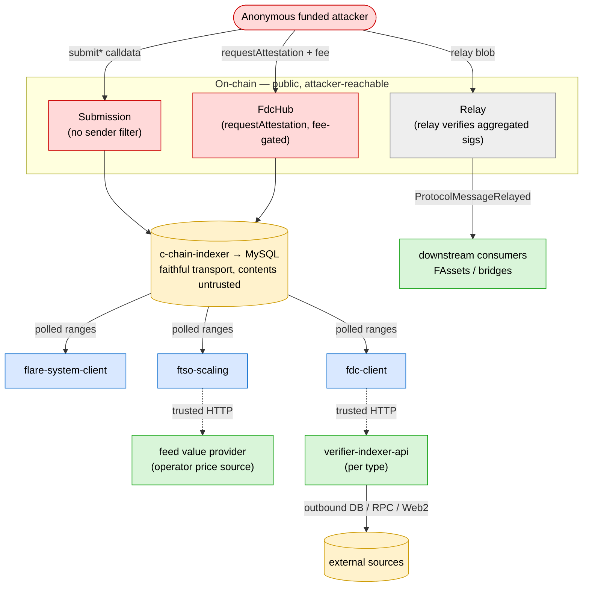
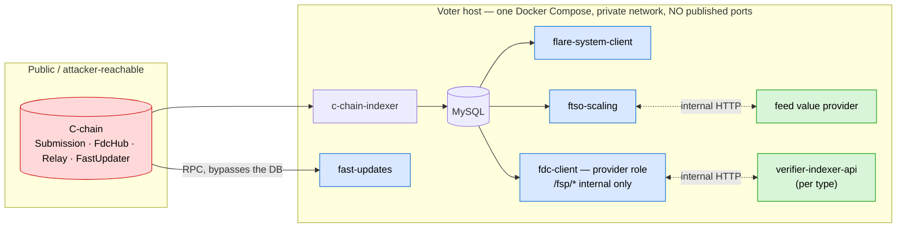

# FSP Attack Surface

This document maps the attack surface of the off-chain Flare Systems Protocol (FSP) services and the on-chain contracts that feed them: where untrusted input enters, which trust boundaries it crosses, what already constrains it, and where the residual risk sits.

---

## 1. Services in scope

Each voter operator runs the services below, plus the shared on-chain contracts all operators read from and write to.

| Component | Lang | Role |
|---|---|---|
| `flare-system-client` | Go | Voter coordinator: window timing, `submit1/2/sigs` txs, peer-signature aggregation, finalization. The single stateful coordinator of the voter's identity. |
| `fdc-client` | Go | FDC subprotocol: attestation collection, bit-vote, consensus branch-and-bound, Merkle root. |
| `verifier-indexer-api` | TS (Nest) | FDC attestation verifier. **One instance per verifier type** (BTC, DOGE, XRP, EVM-per-chain, Web2Json, …); each hosts its type's endpoints, backed by its own indexer DB / upstream RPC / process pool. |
| `flare-system-c-chain-indexer` | Go | Indexes relevant C-chain transactions and logs into MySQL. |
| `ftso-scaling` | TS | FTSO subprotocol: generates commits and reveals for a voter, computes medians and voting round Merkle root. |
| `fast-updates` | Go | FastUpdates subprotocol client: watches the `FastUpdater` contract over RPC and submits sortition-gated incremental feed updates. Reads the chain directly, not through the indexer. |
| `go-flare-common` | Go | Shared Go libraries (DB queries, priority queue, contract bindings, signing-policy types). |
| `Submission` (contract) | Solidity | On-chain message bus. `submit1/2/3/submitSignatures` markers; calldata carries payloads. No sender filter at the contract layer. |
| `Relay` (contract) | Solidity | Canonical finalization sink. `relay()` verifies aggregated signatures, emits `ProtocolMessageRelayed`. |
| `FdcHub` (contract) | Solidity | Attestation-request intake (`requestAttestation`), open to any caller that pays the fee; emits `AttestationRequest(data, fee)`. |
| `FastUpdater` / `FastUpdateIncentiveManager` (contracts) | Solidity | FastUpdates sink. `submitUpdates` (sortition-gated) updates feeds and emits `FastUpdateFeeds*`; the incentive manager takes payable update-rate incentives. |

The feed value provider — the operator's own price source, fetched over HTTP by ftso-scaling — appears only as a trusted input boundary; the reward calculator is out of scope ([§7](#7-out-of-scope)).

Voters never talk to each other directly; all coordination goes through on-chain transactions and events that the indexer captures and the clients read back, so every untrusted input arrives through that one channel. The attacker-controlled part is anonymous `submit*` calldata and `FdcHub` attestation requests (anyone can post one for the fee — the accepted request is emitted as an `AttestationRequest` event the clients pick up). Everything else a voter consumes — its own subprotocol HTTP responses, its own DB writes — it produced, so it trusts. The lone exception to the indexer channel is `fast-updates`, which reads `FastUpdater` directly over RPC ([§5.8](#58-fast-updates)).

---

## 2. Trust boundaries

Solid arrows are on-chain/indexed data flowing inward (results flowing out); dotted arrows are trusted intra-host HTTP calls. Node colour marks trust: red = attacker-reachable, amber = faithful transport but untrusted contents, blue = a client that must validate the untrusted indexed data itself (`ecrecover` to a registered voter, signing-policy weight, schema/eligibility checks), green = operator-trusted, grey (`Relay`) = callable by anyone but signature-gated.

Each boundary crossing, classified by whether the input arriving there is attacker-controlled or operator-trusted:

| Boundary crossing | Input | Classification | Notes |
|---|---|---|---|
| caller → `Submission` | `submit*` calldata (payloads, signatures, reveals) | **attacker-controlled** | No sender filter; the tx succeeds even when the sender is not a registered voter. |
| caller → `FdcHub` | `requestAttestation(data)` + fee | **attacker-controlled** | Open to any caller that pays the fee; the attacker chooses the request shape (type/source/body). |
| caller → `Relay` | `relay(input)` aggregated-signature blob | callable, gated | Anyone can call it, but a valid blob needs threshold signatures and each `(protocol, round)` finalizes only once — a gated entry point, not an anonymous vector ([§2.2](#22-on-chain-inputs-actionable-gated-and-protocol-emitted)). |
| contracts → indexer | raw txs/events | trusted (transport) | The indexer records what was sent; it makes no claim about whether the contents are valid. |
| indexer → Go clients | polled tx/log ranges | **attacker-controlled contents** | The clients re-establish trust themselves via `ecrecover`, signing-policy weight, and schema validation. |
| flare-system-client → ftso-scaling / fdc-client (HTTP) | subprotocol payloads | operator-trusted | Same host; the system-client forwards `OK` data verbatim, so it must drop on `EMPTY`. |
| ftso-scaling → feed value provider (HTTP) | feed values | operator-trusted | ftso-scaling's only HTTP dependency — the operator's own price source. |
| fdc-client → verifier | `VALID` / `abiEncodedResponse` | operator-trusted | The verifier is the oracle; fdc-client does not re-validate beyond MIC and LUT. |
| verifier → Web2/RPC/DB | outbound fetch | mixed | The source's host/path/method are allowlisted, but the requester still influences headers, query, and request shape. |
| Relay → downstream | `ProtocolMessageRelayed` | trusted signal | Downstream consumers (FAssets, bridges) act on the relayed root and trust the finalization signal. |

### 2.1 Deployment topology — what is actually exposed

How the stack is deployed narrows the real surface a lot.

All of a voter's FSP services run on one host, in a single Docker Compose project on a private network. The Compose file publishes no host ports — services reach each other by container DNS, and the only localhost socket is a healthcheck — so the inter-service HTTP (fdc-client's `/fsp/*` API, the verifier endpoints, the feed value provider) is unreachable from outside the host. Every service runs with `restart: unless-stopped`, so a crashed or OOM-killed container restarts automatically (resuming after catch-up). Three consequences:

- **The only externally reachable entry points are on-chain** — the contracts (`Submission`, `FdcHub`, `Relay`, `FastUpdater`) and the chain data the indexer and `fast-updates` read from them. Everything else is behind the host boundary.
- **Internal API keys are not a defence against the external attacker.** Those routes aren't publicly bound, and the verifier's only caller (fdc-client) is trusted; a key matters only against a service already inside the host (post-compromise). "Needs a valid API key" is not a mitigation here, and "an internal route has no rate limit" is not an external threat.
- **An off-chain weakness is exploitable only if it can be driven through an on-chain entry point.** Either it's on-chain-reachable — the attacker shapes data on-chain and a trusted component carries it inward (`submit*` calldata → indexer → clients; `requestAttestation` → fdc-client → the verifier request it forwards; chain volume → indexer DB) — or it's internal-only, needing a direct call to an internal route like the `/fsp/*` provider API that only the co-located system-client uses (post-compromise / defence-in-depth).

### 2.2 On-chain inputs: actionable, gated, and protocol-emitted

Every untrusted input arrives as an on-chain transaction or event — captured by the indexer, or for `fast-updates` alone read over RPC ([§2.1](#21-deployment-topology--what-is-actually-exposed)). What matters is not whether the clients read or write each one, but *who can trigger or shape it*.

**(A) Actionable.** Triggerable and/or shapeable by an attacker or an unprivileged user — the real injection surface.

| Tx / event | Contract | Who can trigger | Shaped by | Notes |
|---|---|---|---|---|
| `submit1` (commit) | Submission | **anyone** | caller | The tx succeeds and the calldata persists even for unregistered senders; the clients re-gate by `ecrecover` plus weight. Sender = submit address. |
| `submit2` (reveal) | Submission | **anyone** | caller | Feeds the FTSO median, which is gated by registered-voter eligibility on the real tx sender. Sender = submit address. |
| `submit3` | Submission | **anyone** | caller | Another submit marker, with the same persist-even-if-unregistered property. |
| `submitSignatures` | Submission | **anyone** | caller | The substrate for the listener-stall concern; gated by `ecrecover` to a registered voter. Sender = submitSignatures address. |
| `requestAttestation` → `AttestationRequest` | FdcHub | **anyone (fee-gated)** | requester | The requester fully controls the request body — type, source, block window, confirmations, destination, Web2 headers. The event is contract-emitted, but its content is attacker-shaped, which makes it the FDC fan-out injection vector. |
| `offerRewards` → `RewardsOffered` | FtsoRewardOffersManager | anyone (payable, ≥ min per offer) | offerer | Community FTSO reward offers for the *next* epoch; the attacker picks each `feedId` and amount. The event content is attacker-shaped and **defines the round's canonical feed set/order**, so it's an availability lever — not just a reward-side input ([§5.5](#55-ftso-scaling)). |
| FastUpdate incentives | FastUpdateIncentiveManager | anyone (payable) | offerer | Pays to raise the fast-update rate — cadence plus the out-of-scope reward side ([§5.8](#58-fast-updates)). |

**(B) Gated entry points.** Callable by anyone, but a successful call needs a credential — without it the call reverts, and a valid call is just honest protocol behaviour. Not anonymous vectors; only each one's residual angle matters.

| Tx | Contract | What a successful call needs | Residual angle |
|---|---|---|---|
| `relay()` | Relay | valid threshold signatures for the round; each `(protocol, round)` finalizes only once (`Already relayed` on a repeat) | none beyond the threshold-signature gate |
| `submitUpdates()` | FastUpdater | a won verifiable-sortition credential and a signature from a registered provider, inside the submission window | none beyond the sortition + signature gate |
| `registerVoter` → `VoterRegistered`, `VoterRegistrationInfo` | VoterRegistry, FlareSystemsCalculator | enough stake/weight to clear the registration bar | registration weight × vote-power-block interaction — the one genuinely non-anonymous "read" surface |

**(C) Protocol-emitted.** Produced by contract logic, threshold-signing, or governance. An attacker can't trigger, forge, spam, or shape them, so the clients read them as trusted baseline state.

| Event | Contract | Cadence / gate |
|---|---|---|
| `SigningPolicyInitialized` | Relay | Once per reward epoch — the canonical voter set and weights the clients gate against. |
| `ProtocolMessageRelayed` | Relay | Once per finalized round, only after a valid threshold-signed `relay()`. Read for finalization idempotency. |
| `RewardEpochStarted` | FlareSystemsManager | Once per reward epoch. |
| `RandomAcquisitionStarted` | FlareSystemsManager | Once per reward epoch. |
| `VotePowerBlockSelected` | FlareSystemsManager | Once per reward epoch — a uniformly-random *past* block derived from secure FTSO randomness. |
| `SigningPolicySigned` / `UptimeVoteSigned` / `RewardsSigned` | FlareSystemsManager | Emitted once a threshold of registered voters has signed — voter-driven, but threshold-gated and not anonymously forgeable. |
| `FastUpdateFeedsSubmitted` | FastUpdater | Per successful sortition-gated `submitUpdates()`. |
| `FastUpdateFeeds` | FastUpdater | Per voting round — emitted automatically by the flare daemon (`daemonize`) on epoch rollover, publishing the current-feed snapshot. |
| `InflationRewardsOffered` | FtsoRewardOffersManager | Governance/inflation, once per epoch — feeds the out-of-scope reward calculator. |

**(D) Operator self-writes.** A voter's own outbound txs — `signNewSigningPolicy`, `signUptimeVote`, `signRewards`, plus its own `submit*` and `relay()` — use its own keys and aren't an inbound surface; they matter only when a client stalled by category (A) misses their deadlines.

Category (A) is the anonymous injection surface and the focus below. (B) is callable but reverts without the right credential, so only each entry's residual angle matters. (C) is trusted protocol state — the clients treat it as trusted and fail loud if it's absent; an attacker can't drive it.

---

## 3. Security goals

The properties every threat below is measured against. Two matter, plus a downstream corollary:

- **Availability** — a voter keeps participating. No anonymous input should stall its finalization path past the round's deadlines (the ~90 s round, with signature/finalize deadlines around 56–65 s), crash-loop a client, or exhaust the host's CPU, memory, or DB. This is tiered: finalization availability is provider-critical, while the indexer's disk footprint is lower-criticality.
- **Soundness** — a finalized output reflects only eligible-voter inputs. No anonymous on-chain data changes a finalized FTSO median or FDC result; no attacker-shaped attestation request yields a proof that misrepresents chain reality; and a finalization is only ever accepted as a valid threshold-signed message from the round's registered voter set.
- **Downstream fund safety** (corollary) — FAssets and bridges act on the relayed root, so soundness plus availability of finalization is what keeps a finalized root from authorising movements an honest round wouldn't.

---

## 4. Attacker model

Two attacker kinds matter, separated by capability. The first is a funded anonymous account — everything it does reduces to paying gas and fees, and sending transactions vs posting attestation requests are just two cost profiles of one actor. The second needs a registered voter key. Numbers are Flare mainnet today; Songbird is ~3× weaker per round at the same dollar cost, so hardening must hold there too.

**Cost basis (Flare, current).** ACP-176 dynamic gas: target `T = 2,000,000` gas/s, sustained ceiling `R = 2T = 4,000,000` gas/s; over a ~90 s round that's ~360M gas sustained, up to ~20M per block burst. Min base fee `M` is 1 Wei today (planned to rise to 500 Gwei); the production 100 Gwei priority-fee floor sets the attacker's effective gas price during FSP windows. The prioritised-call refund applies only to a registered voter's first valid `submit*` per round, so anonymous spam never qualifies.

### 4.1 Anonymous on-chain attacker
A funded, identity-less account; everything is a matter of paying gas and fees. Two vectors, differing only in cost and target:

- **`submit*` calldata** to `Submission`, from any number of EOAs — the tx succeeds and is indexed regardless of sender. Gas-only, so the listener / finalizer / indexer paths are the cheapest to attack.
- **Attestation requests** via `requestAttestation`, paying the per-`(type, source)` fee (1 FLR/SGB most types, 20 for XRP-payment, 100 for Web2Json), shaping the whole request body (type, source, block window, confirmations, destination, Web2 headers); every fdc-client picks it up. Gas + fee; ~$42/round (≈2,100 requests), ~$40K/day sustained.

It can also *call* the gated entry points (`relay()`, `submitUpdates()`, `registerVoter`), but they revert without the right credential — not vectors ([§2.2](#22-on-chain-inputs-actionable-gated-and-protocol-emitted)). It cannot `ecrecover` to a registered voter, force a `VALID` verifier response, escape the weighted bit-vote consensus, choose what gets indexed, or exceed the gas budget.

### 4.2 Registered-voter insider
Submits from a recognised submit/signatures address, so its payloads clear the `ecrecover`+weight gate; it can send excessive or wrong-valued payloads within its own weight. It can't exceed its signing weight (outliers are down-weighted) or finalize for others. Buying weight into the signing policy costs ~$200K/slot for little, so it isn't cost-effective.

---

## 5. Per-service attack surface

Per service: where untrusted input enters, what constrains it, and where the residual risk sits. Entry points are **external** (reachable via an on-chain entry point) or **internal-only** (reachable only by a host peer), per [§2.1](#21-deployment-topology--what-is-actually-exposed).

### 5.1 flare-system-client
External entry: the `submitSignatures` listener (polls the indexer, walks each matching tx's calldata), the finalizer queue, and the signing-policy / voter-registry consumers. Every indexed `submitSignatures` payload is attacker-controlled until proven otherwise. Gates: each signature must `ecrecover` to a registered voter with non-zero weight or it's dropped; finalization is idempotent (re-reads `ProtocolMessageRelayed`); missing critical metadata panics by design (peers can't reach it). Residual risk: the work done per attacker tx *before the signer is known* — calldata decode, payload extraction, and any buffering keyed on attacker-controlled sender/round/protocol ahead of the `ecrecover` gate; how ECDSA-recovery cost scales with distinct funded senders; whether the listener/queue/policy goroutines survive a panic; threshold-raise and slashing-window timing under a stalled listener.

### 5.2 fdc-client
External entry: `AttestationRequestListener`, `BitVoteListener`, and the queue workers, fed by `AttestationRequest` events and `submit2` calldata. The `/fsp/*` provider API is internal-only (the system-client is its only caller). Gates: the per-round attestation count hard-errors above 65,535, branch-and-bound is operation-capped and gated on that (unreachable) ceiling, the gas budget keeps requests well under it, and bit-votes are weight-aggregated. Residual: request bytes stored verbatim before validation (including minimal-length requests that enter round state before rejection); uncached, repeatable round-derived computation (Merkle tree, bit-vote sort); goroutines without panic recovery.

### 5.3 verifier-indexer-api (per verifier type)
Entry: `POST <type-URL>/<AttestationType>/verifyFDC`. The endpoint is internal but its surface is external — the request content is anonymous on-chain `requestAttestation` data the trusted fdc-client forwards verbatim, so the API key gates nothing. The attacker controls the full request body (block window, `requiredConfirmations`, `listEvents`/`logIndices`, destination/amount, Web2Json headers/query). Gates: fdc-client's outbound rate limit is the only throttle for non-Web2Json types; only Web2Json has a worker pool and backpressure; the Web2 SSRF base is solid (DNS / private-IP checks, HTTPS, near-zero redirects, host/path/method allowlist, JSON depth/key bounds). Residual: any requester field that drives an unbounded DB range scan or large in-memory set (wide windows, low-selectivity filters, missing `LIMIT`); event/list truncation that silently changes a proof; a missing confirmation-depth floor; requester headers/query forwarded upstream (tenant, cache, method-override, forwarding); per-type latency under load with no global throttler.

### 5.4 flare-system-c-chain-indexer (→ fsp-indexers)
Entry: JSON-RPC block polling and the MySQL tables both Go clients read. Attacker input: the volume and size of matching txs/events it must store (spam `submit*` and `requestAttestation`). It filters by `(to_address, selector)` / `(address, topic0)`, has per-table watermarks, and benefits from the chain-level prioritised-calldata cap. The defining gap is the absence of a sender filter — all anonymous spam calldata is stored and re-read, the substrate every downstream listener inherits. Other residual: unbounded calldata/data columns and unbounded query result sets; DB retention footprint under sustained spam; reorg handling for signing-policy-derived state (latent today, load-bearing once any indexer-side voter-set filter ships).

### 5.5 ftso-scaling (median / reward libs)
Entry: reveal ingestion from `submit2` calldata, feeding median and Merkle-root computation; the input is anonymous `submit2` calldata claiming any `(protocolId, roundId, payload)`. Gates are good: reveals are filtered by registered-voter eligibility (keyed on the real tx sender, not forgeable payload data) before the median, the median is weight-bounded, and empty/absent reveals contribute nothing.

A second input shapes the round itself. The epoch's **canonical feed order** — the set and ordering of feeds every round prices, medians, and Merkle-roots — is derived (`rewardEpochFeedSequence`) from inflation offers (governance) plus community `RewardsOffered` (`offerRewards`, permissionless, ≥ `minimalRewardsOfferValueWei` per offer, community feeds ordered by total offered value). So for the next reward epoch an attacker can add arbitrary `feedId`s and reorder the non-inflation feeds. It's deterministic on-chain (all nodes agree — no consensus split) and per-feed medians stay independent (an unpriced attacker feed resolves to empty, not poisoning real ones), so the impact is availability/resource, not soundness: every added feed is fetched from the feed value provider, medianed, and added as a Merkle leaf on every round for the whole epoch, across all voters — a one-time payment (≥ min × feed count, paid into the reward pool) amplified over the epoch. There is no feed-count cap in the canonical-order builder; the only gate is the per-offer minimum.

Residual: whether every aggregation path (median, random, weight sum) consumes only the eligibility-filtered set; determinism of duplicate/out-of-order/tie handling across nodes; precision of the median/weight arithmetic; and the feed-list inflation above.

### 5.6 go-flare-common (shared library)
Provides the DB query builders, priority queue, and signing-policy types, in the trust path of both Go clients — so a weakness here is inherited by every consumer. Relevant areas: the query builders' filtering and result-set bounds (the shared root of the indexer-substrate concerns), bounds-checking in the payload and bit-vote parsers, and integer-width handling in weight/index accumulation.

### 5.7 On-chain contracts (Submission, Relay, FdcHub)
`Submission` has no sender filter (the listener-spam premise); its `submitAndPass` forwards caller-controlled calldata to a governance-set target with `msg.sender = Submission`, warranting a per-chain config audit. `Relay`'s only external entry is the signature-gated `relay()` (a gated entry point, [§2.2](#22-on-chain-inputs-actionable-gated-and-protocol-emitted)). `FdcHub.requestAttestation` is open to any fee-paying caller (checks only `msg.value >= fee`) — the entry point for the whole FDC verifier fan-out.

### 5.8 fast-updates
A separate subprotocol with its own client (`fast-updates`, Go) and contracts (`FastUpdater`, `FastUpdateIncentiveManager`). It reads chain state directly over RPC — fixed contract getters (block number, seed, score cutoff, current feeds) via `eth_call`, not the indexer and not log/range scans — so there's no attacker-volume-driven result set to bound. `submitUpdates()` is a gated entry point ([§2.2](#22-on-chain-inputs-actionable-gated-and-protocol-emitted)) — callable by anyone, but a success needs a won sortition credential plus a registered provider's signature in the window, else it reverts; the client is the prover (it generates its own credential with its own key) and verifies no attacker-supplied input. Its events are protocol-emitted: `FastUpdateFeedsSubmitted` per submission, `FastUpdateFeeds` per round (published by the flare daemon on epoch rollover). The one anonymous lever is paying `FastUpdateIncentiveManager` to raise the update rate — cadence and the out-of-scope reward side, not soundness. Residual: goroutine crash-resistance (no `defer recover()` on the submission/queue goroutines) and panic-on-malformed fragility in the feed/delta math — both sit behind protocol- or operator-trusted inputs today, so they're latent rather than anonymously reachable.

---

## 6. Cross-cutting surfaces

Two concerns span services:

- **Goroutine crash-resistance.** An unrecovered panic on any goroutine crashes the whole Go process — none of the Go clients (flare-system-client, fdc-client, fast-updates) wrap their goroutine entry points in `defer recover()`. Because every service runs under Docker `restart: unless-stopped` ([§2.1](#21-deployment-topology--what-is-actually-exposed)), a one-off crash auto-restarts, costing only the rounds missed during restart and catch-up — not a permanent halt. The sharper risk is a *replayable* attacker-triggered panic: an input re-read from the indexer on every restart would crash-loop despite the restart policy. No such reachable panic is currently known (the data-path parsers are bounds-checked), so `defer recover()` is defense-in-depth — but the restart policy makes it the crash-loop containment, which is where its value lies if a reachable panic is ever found.
- **Unbounded resources keyed on attacker-controlled volume.** The recurring pattern: maps, DB queries, and serialization sized by attacker volume with no cap or `LIMIT`, plus uncached per-round recompute. Fix with a cap/`LIMIT` at the ingest or query boundary and caching of round-derived computation; prioritise the externally reachable, finalization-impacting cases over the internal-only ones.

---

## 7. Out of scope

- **Reward-amount fairness and reward-calculation correctness** — the post-epoch reward calculator is separate; in-weight insider griefing is caught there.
- **Data-availability (DA) instances** — fdc-client and ftso-scaling can each run a dedicated public DA read API (attestation responses; median results / feeds-with-proof) for downstream consumers. These are accessory services on separate, isolated instances with their own round state, so overloading one affects only that read service's availability — never FSP provider operation or finalization. Audit separately if exposed.
- **Validator and chain-level concerns the FSP team doesn't own** — block storage, mempool sizing, Avalanche consensus, `avalanchego`/`coreth` internals.
- **Operator-trusted inputs** — a voter's own subprotocol HTTP responses (`ftso-scaling`, `fdc-client`, feed value provider) run on the trusted host. The drop-on-`EMPTY` obligation and the verifier-as-oracle assumption are boundary obligations, not attack surface.
- **Critical-metadata panics by design** — panicking on missing signing-policy / voter-registry data is intentional fail-loud; peer spam can't reach it.
- **By-design economic limits** — buying into the signing policy, and Submission-upgrade coordination, are not cost-effective / coordination-only.
